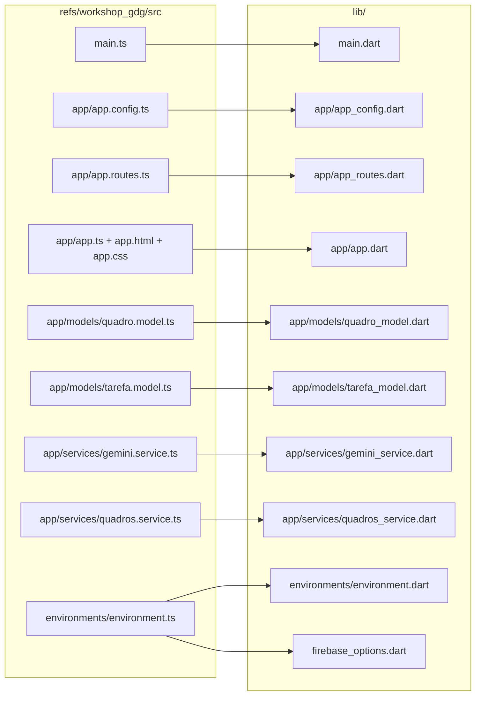

## Reference structure (Angular → Flutter mapping)



## Dependency & tooling setup

- Update [pubspec.yaml](pubspec.yaml) to add:
  - `firebase_core` (Firebase bootstrap, all platforms)
  - `cloud_firestore` (mirrors `firebase/firestore`)
  - `google_generative_ai` (Dart equivalent of `@google/genai`)
- Run `flutterfire configure --project=workshop-gdg-rec` to:
  - Generate `lib/firebase_options.dart`
  - Add `android/app/google-services.json`
  - Add `ios/Runner/GoogleService-Info.plist`
  - Patch Gradle (`android/build.gradle`, `android/app/build.gradle`) and `ios/Runner/Info.plist` automatically.
- `android/app/build.gradle`: confirm `minSdkVersion >= 21` (Firestore requirement); bump if needed.
- `ios/Podfile`: confirm `platform :ios, '13.0'` (Firestore requirement); bump if needed.
- `web/index.html`: update `<title>` to `Plan w/ AI` (mirror of Angular `index.html` title block). No Firebase JS SDK needed — `firebase_core_web` handles it via `firebase_options.dart`.

## Class & file mapping (same class names, snake_case files)

- [lib/main.dart](lib/main.dart) — equivalent of [refs/workshop_gdg/src/main.ts](refs/workshop_gdg/src/main.ts). Runs `WidgetsFlutterBinding.ensureInitialized()`, `Firebase.initializeApp(options: DefaultFirebaseOptions.currentPlatform)`, sets Firestore debug log level when not production (mirror of `setLogLevel('debug')`), then `runApp(const App())`.
- [lib/app/app_config.dart](lib/app/app_config.dart) — mirror of [app.config.ts](refs/workshop_gdg/src/app/app.config.ts). Holds an `appConfig` const placeholder (Angular providers list is empty; we keep the file for structural fidelity and future DI hooks).
- [lib/app/app_routes.dart](lib/app/app_routes.dart) — mirror of [app.routes.ts](refs/workshop_gdg/src/app/app.routes.ts). Empty `routes` list (kept for fidelity).
- [lib/app/app.dart](lib/app/app.dart) — mirror of [app.ts + app.html + app.css](refs/workshop_gdg/src/app/app.ts):
  - `class App extends StatefulWidget` with `_AppState` holding:
    - `String textoTarefas` (mirrors `textoTarefas`)
    - `Quadro? quadroAtual` (mirrors `quadroAtual` signal)
    - `List<Quadro> historico` (mirrors `historico` signal)
    - `bool carregando`, `bool salvando`, `String? erro`
  - `late final GeminiService geminiService` and `late final QuadrosService quadrosService` (constructed in `initState`).
  - Methods with identical names: `organizarComIA()`, `tarefasPorStatus(StatusTarefa)`, `moverTarefa(Tarefa, StatusTarefa)`, `salvarQuadro()`, `carregarHistorico()`, `abrirQuadro(Quadro)`.
  - `build()` recreates the HTML structure: hero (eyebrow / h1 / subtitle), panel (label + multi-line `TextField` + two action buttons + error text), kanban board (3 columns: "A fazer", "Em andamento", "Concluído"), and history list.
  - Theme: black `Scaffold` background, red accent `#FF005C`, Inter font fallback, dark cards with red left-border (`Container` + `Border(left: BorderSide(width: 2, color: pink))`), uppercase tag chips.
  - Responsive: `LayoutBuilder` swaps the kanban from 3-column `Row` to a single-column `Column` when `maxWidth < 980` (mirrors the CSS media query).
- [lib/app/models/quadro_model.dart](lib/app/models/quadro_model.dart) — mirror of [quadro.model.ts](refs/workshop_gdg/src/app/models/quadro.model.ts). `class Quadro { String? id; String tituloQuadro; List<Tarefa> tarefas; String? criadoEm; }` with `Quadro.fromJson`/`toJson`.
- [lib/app/models/tarefa_model.dart](lib/app/models/tarefa_model.dart) — mirror of [tarefa.model.ts](refs/workshop_gdg/src/app/models/tarefa.model.ts). Five Dart enums (`CategoriaTarefa`, `PrioridadeTarefa`, `EsforcoTarefa`, `PrazoSugerido`, `StatusTarefa`) whose string values exactly match the Angular union types (`a_fazer`, `em_andamento`, `concluido`, etc.) via `name`/`fromString`. `class Tarefa { String titulo; CategoriaTarefa categoria; PrioridadeTarefa prioridade; EsforcoTarefa esforco; PrazoSugerido prazoSugerido; StatusTarefa status; }` with JSON helpers.
- [lib/app/services/gemini_service.dart](lib/app/services/gemini_service.dart) — mirror of [gemini.service.ts](refs/workshop_gdg/src/app/services/gemini.service.ts):
  ```dart
  class GeminiService {
    final _ai = GenerativeModel(model: 'gemini-2.5-flash', apiKey: Environment.geminiApiKey);
    Future<Quadro> organizarTarefas(String textoUsuario) async { ... }
    String _criarPrompt(String textoUsuario) { ... }  // exact same prompt text as Angular
    Quadro _converterRespostaParaQuadro(String resposta) { ... }
  }
  ```
  The prompt string is copied verbatim from the Angular service so Gemini output stays identical.
- [lib/app/services/quadros_service.dart](lib/app/services/quadros_service.dart) — mirror of [quadros.service.ts](refs/workshop_gdg/src/app/services/quadros.service.ts):
  ```dart
  class QuadrosService {
    final _quadrosRef = FirebaseFirestore.instance.collection('quadros');
    Future<void> salvarQuadro(Quadro quadro) async { ... }   // adds criadoEm = DateTime.now().toIso8601String()
    Future<List<Quadro>> listarQuadros() async { ... }       // orderBy('criadoEm', descending: true)
  }
  ```
- [lib/environments/environment.dart](lib/environments/environment.dart) — mirror of [environment.ts](refs/workshop_gdg/src/environments/environment.ts). A `class Environment` with `static const bool production = false`, `static const String geminiApiKey = '...'`. Firebase config keys (apiKey/projectId/etc.) live in the generated `firebase_options.dart` rather than being duplicated here, which is the FlutterFire-idiomatic equivalent of the Angular `firebaseConfig` block.

## Tests

- [test/app_test.dart](test/app_test.dart) — mirror of [app.spec.ts](refs/workshop_gdg/src/app/app.spec.ts). A basic `testWidgets` that pumps `App` and asserts an `h1`-equivalent (`Do Caos ao Kanban`) renders. Firebase calls are not exercised in this test (keeping parity with the Angular test, which also doesn't hit Firestore).

## Non-goals / explicit caveats

- Pixel-perfect CSS parity is not promised: borders, spacing, hover transitions, and uppercase-letter spacing will be visually close (same palette, same layout structure, same typography hierarchy) but implemented with Flutter `Theme`/`TextStyle`/`Container` rather than literal CSS.
- The Gemini API key is reproduced from the Angular `environment.ts` as a hardcoded constant for fidelity. If you'd like it moved to `--dart-define` later, that's a small follow-up.
- Running `flutterfire configure` will prompt interactively (account login + platform selection) and will register Android/iOS apps in the `workshop-gdg-rec` Firebase project. I will run it during implementation and pause for any prompts that need your input.
